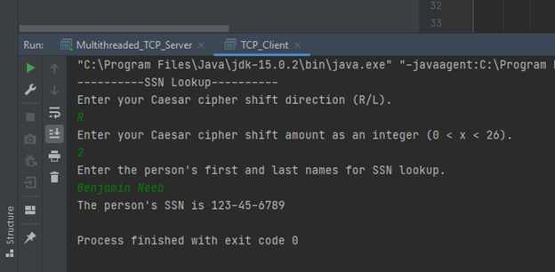
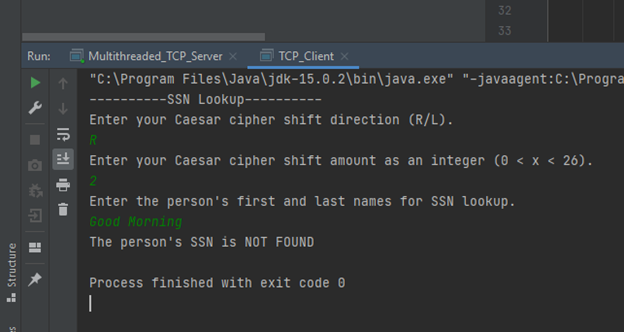
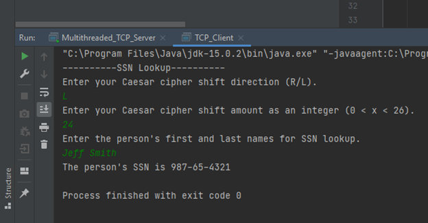
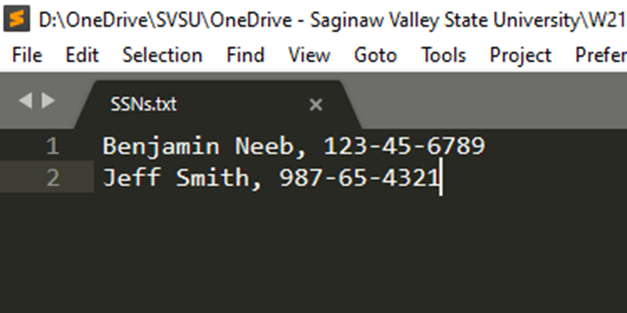

# Caesar-Cipher-Cryptography-Over-TCP
Uses Caesar Cipher encryption to encode and decode data transmitted over a network.

**Details on how to execute code**

The program will firstly ask the user for left or right shifting. The only accepted responses are R, L, r, and l. If the user does not respond with one of these characters, the user is asked again for a shift character. 
  
Secondly, the program will ask the user for a shift amount. The only accepted responses are integer values from 1 to 25. If the user does not respond with an integer value of 1 – 25, the user is asked again for a shift amount.

Thirdly, the user is asked for a person’s name. There is no limitation on how the person’s name is entered. However, if the user wishes for a SSN response, the name entered must match the name on file. Before executing the code, ensure the text (SSNs.txt) file is in the running directory. This is where the SSNs are stored. To successfully store and look-up SSNs, the file must be formatted as follows:

* Firstname Lastname, SSN

An example would appear as follows:

* Benjamin Neeb, 123-45-6789
*	Jeff Smith, 987-65-4321

*Note that each entry occupies a new line*

**Screenshots of sample outputs**

